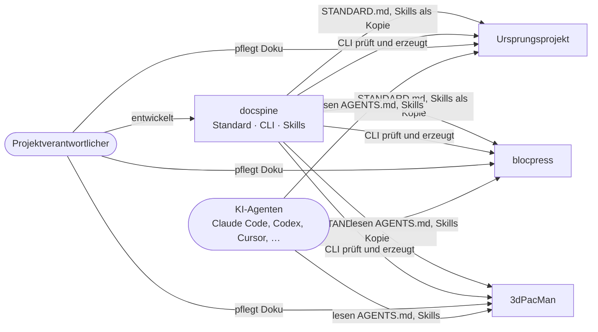

# Kontext

| Nachbar | Beziehung zu docspine |
|---|---|
| Ursprungsprojekt | Ursprung der Methodik, nicht öffentlich, Java mit Maven, eigenes Gate |
| blocpress | übernommene Methodik, Java mit Maven, AsciiDoc-Altbestand |
| 3dPacMan | 6502-Assembler, kein Maven, Doku bisher ohne Frontmatter und ohne Gate |
| KI-Agenten | lesen `AGENTS.md`, `STANDARD.md` und Skills nach dem Agent-Skills-Standard |
| GitHub | Hosting der Projekte, stellt Markdown und Mermaid direkt dar |
