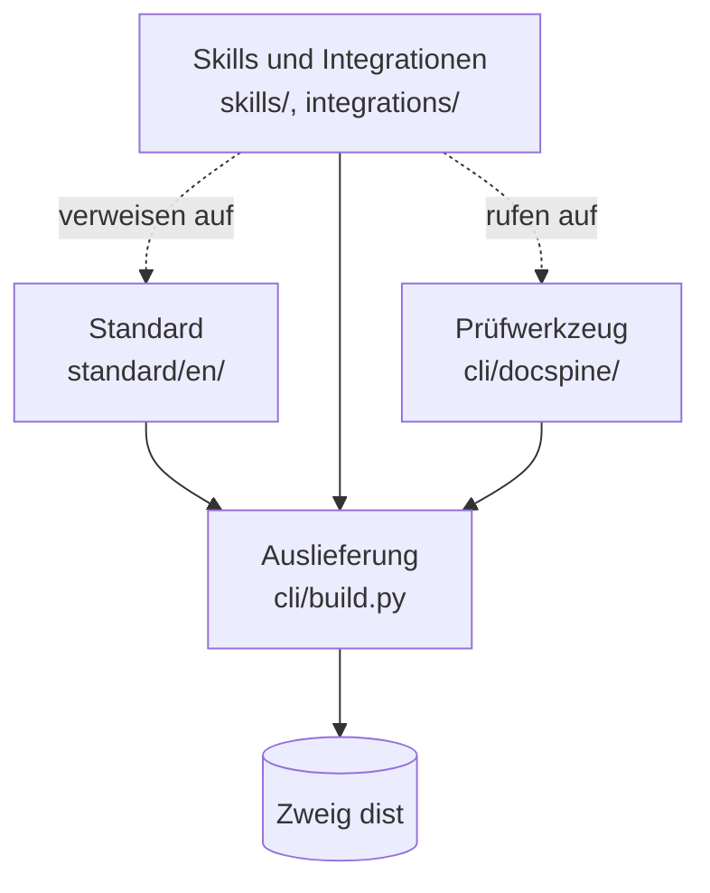

# Lösungsstrategie

Die grundlegenden Entscheidungen, mit denen docspine seine Ziele erreicht. Begründet sind
sie in den ADRs, hier steht nur, wie sie zusammenspielen.

| Ziel | Ansatz | Entscheidung |
|---|---|---|
| Doku, die Mensch und KI gleich gut lesen | Markdown mit YAML-Frontmatter als einziges Quellformat, gegliedert nach arc42, Diagramme als Text | ADR-0001, ADR-0007, ADR-0002 |
| Keine widersprüchlichen Kopien | Jede Aussage steht an einer Stelle. Beziehungen stehen nur in eine Richtung im Frontmatter, alle anderen Richtungen und Übersichten erzeugt `render` | ADR-0003, ADR-0008 |
| Prüfbar statt behauptet | Ein Prüfwerkzeug meldet Regelverstöße. Ob ein Requirement umgesetzt ist, entscheiden Testergebnisse, keine Person | ADR-0005, ADR-0013, ADR-0018 |
| Läuft überall ohne Installation | Das Prüfwerkzeug ist eine einzige Datei, nur Python-Standardbibliothek, PyYAML eingepackt | ADR-0012, REQ-0015 |
| Unabhängig von Build-Werkzeugen | Die Anbindung an Build und Tests ist ein Vertrag; je Werkzeugkette beschreibt eine Integration, wie er erfüllt wird | ADR-0019, ADR-0022 |
| Unabhängig vom KI-Werkzeug | Regeln stehen in normalen Dateien (`AGENTS.md`, `STANDARD.md`, `PROFILE.md`); Skills nach dem offenen Agent-Skills-Standard führen nur durch die Abläufe | ADR-0009, ADR-0010 |
| Jedes Projekt kann auf seinem Stand bleiben | Der Standard wird als versionierte Kopie ins Projekt geschrieben, nicht verlinkt | ADR-0004, ADR-0016, ADR-0017 |
| Ein Standard für viele Projekte | Gemeinsamer Kern im Standard, Projektwerte und begründete Abweichungen im Profil | ADR-0006, ADR-0015 |
| Mehrsprachig ohne Übersetzung der Maschinensprache | Doku in der Projektsprache, Frontmatter, Dateinamen und Statements englisch | ADR-0011, ADR-0014 |

docspine dokumentiert sich selbst nach dem eigenen Standard. Jede Regel wird damit zuerst
hier erprobt, bevor sie ausgeliefert wird. Abweichungen, die sich daraus ergeben, stehen
im Profil. _(confidence: verified — .docspine/PROFILE.md)_

## Zerlegung

Die Bausteine im Einzelnen: [05-building-blocks/](05-building-blocks/).
_(confidence: verified — cli/build.py)_
