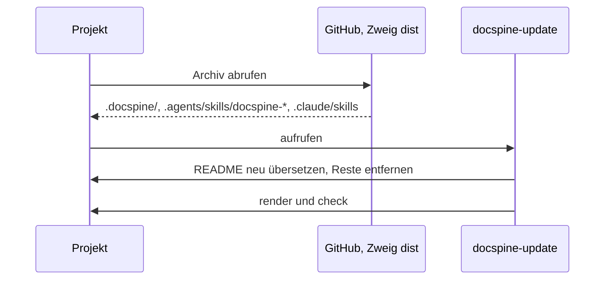

# Installation und Update

Installation und Update sind derselbe Befehl im Wurzelverzeichnis des Projekts:

```
curl -fsSL https://github.com/flaechsig/docspine/archive/refs/heads/dist.tar.gz | tar -xz --strip-components=1
```



1. Das Archiv überschreibt nur, was docspine gehört (Standard 2.2). Was das Projekt
   selbst geschrieben hat, bleibt.
2. Dateien, die docspine nicht mehr ausliefert, löscht das Archiv nicht. `docspine-update`
   findet sie über den Abgleich mit `.docspine/MANIFEST` und entfernt sie nach Rückfrage.
3. Hat sich die englische Quelle der README geändert, übersetzt `docspine-update` sie neu.
   Die Prüfung meldet eine veraltete Übersetzung als Fehler 14.

_(confidence: verified — README.md, cli/build.py, skills/docspine-update/SKILL.md,
REQ-0027, ADR-0016)_
