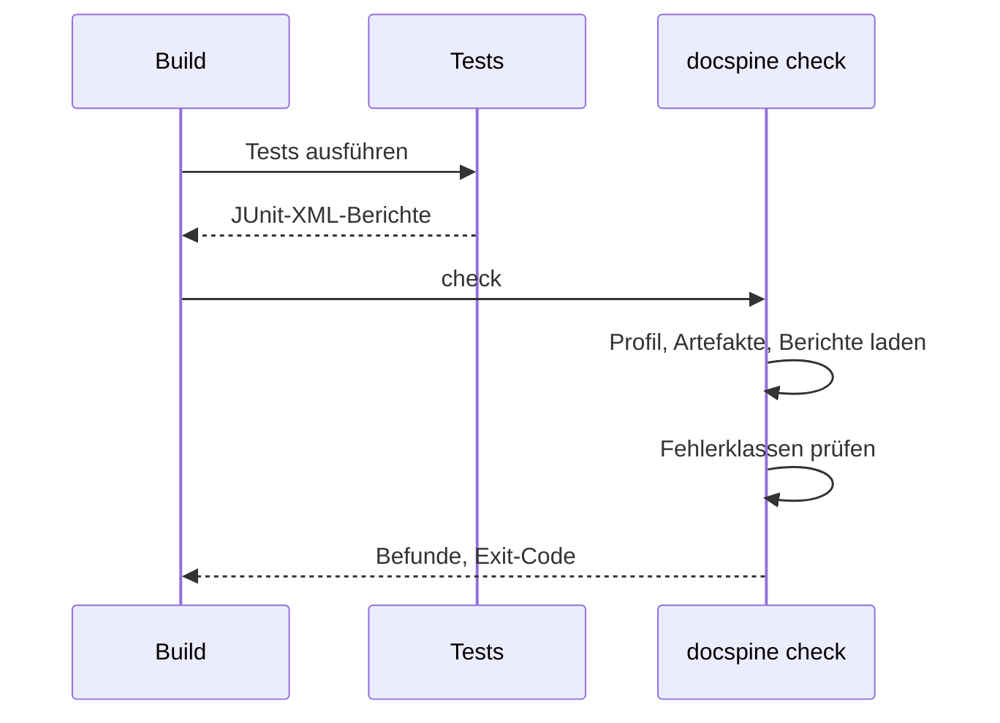

# Prüfung im Build

Ein Projekt baut und testet wie gewohnt; danach läuft die Prüfung als eigener Schritt
und lässt den Build bei einem Fehler scheitern.

1. Die Tests tragen die Requirement-ID im Namen, etwa `REQ-0012: …`.
2. Die Prüfung findet die Berichte über `test_reports` im Profil oder sucht sie selbst.
3. Ein bestandener Test mit der ID belegt das Requirement. Fehlt der Beleg für ein
   umgesetztes Requirement, meldet sie Fehler 8; besteht ein Test für ein nur geplantes,
   Fehler 9.
4. Bei mindestens einem Befund endet sie mit Exit-Code 1, und der Build scheitert.

`render` gehört nicht in den Build: Es ändert Dateien, der Build soll nur prüfen.
_(confidence: verified — cli/docspine/project.py, cli/docspine/check.py, REQ-0012,
REQ-0029, ADR-0022, integrations/maven-junit5.md)_
