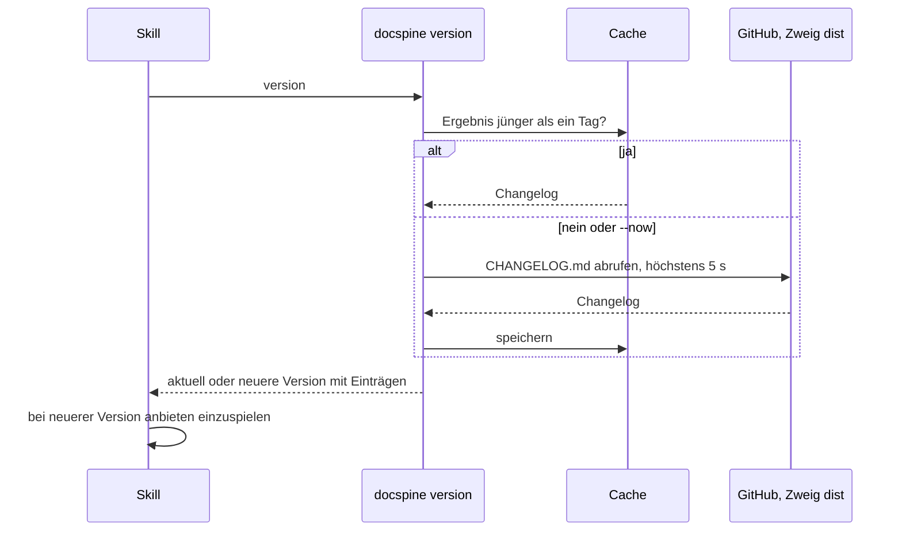

# Versionshinweis beim Start eines Skills

1. Die Arbeits-Skills (`spine-require`, `-impact`, `-decide`, `-build`, `-prove`,
   `-gate`) rufen den Befehl als Erstes auf.
2. Ist eine neuere Version da, nennt der Skill sie mit der Release-Note und bietet an,
   sie auf einem eigenen Branch einzuspielen ([Installation und Update](installation-und-update.md)).
   Er fragt vorher, weil Dateien von außen geholt werden.
3. Ohne Netz meldet der Befehl, dass er nicht prüfen konnte, und der Skill arbeitet
   weiter.

_(confidence: verified — cli/docspine/version.py, skills/spine-require/SKILL.md,
REQ-0042, REQ-0043, REQ-0044, ADR-0025)_
