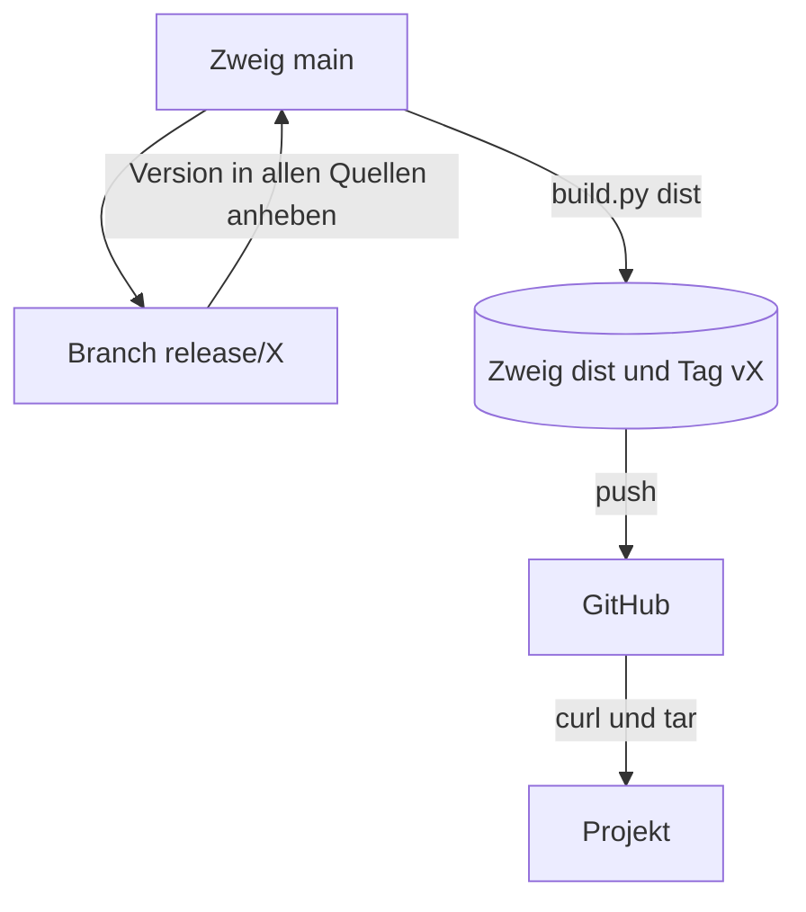

# Verteilung

docspine läuft nicht als Dienst. Es wird als Dateien in jedes Projekt kopiert und dort
mit Python ausgeführt.

## Was ein Projekt bekommt

| Pfad im Projekt | Quelle in docspine |
|---|---|
| `.docspine/STANDARD.md` | `standard/en/STANDARD.md` |
| `.docspine/README.en.md` | `standard/en/README.md` |
| `.docspine/docspine.pyz` | gebaut aus `cli/docspine/` |
| `.docspine/CHANGELOG.md`, `.docspine/LICENSE` | `CHANGELOG.md`, `LICENSE` |
| `.docspine/MANIFEST` | Liste aller ausgelieferten Dateien, beim Bauen erzeugt |
| `.agents/skills/spine-*` | `skills/` |
| `.agents/skills/spine-gate/integrations/` | `integrations/` |
| `.claude/skills` | symbolischer Link auf `../.agents/skills` |

_(confidence: verified — cli/build.py)_

## Vom Repository zum Projekt

1. **Release vorbereiten:** Auf einem Branch `release/X` wird die Version in der ersten
   Zeile von Standard und README, im Prüfwerkzeug, in `cli/pyproject.toml`, in der
   Kopie `.docspine/STANDARD.md` und in `docs/README.md` angehoben; der Abschnitt
   „Unreleased“ im Changelog bekommt die Versionsnummer.
2. **Ausliefern:** `python3 cli/build.py dist` schreibt die Auslieferung als neuen Commit
   auf `dist`, ohne die Arbeitskopie anzufassen, und setzt den Tag `vX`. Es verweigert
   den Commit, wenn sich die Auslieferung geändert hat, die Version aber nicht, oder wenn
   der Tag schon existiert.
3. **Veröffentlichen:** `dist` und der Tag werden nach GitHub gepusht. Ab dann
   installieren Projekte die neue Version, und `version` meldet sie spätestens einen Tag
   später.

_(confidence: verified — cli/build.py, Commit „release: Version 0.17“, ADR-0017)_

Zum Erproben vor einem Release schreibt `python3 cli/build.py install <projekt>` den Stand
der Arbeitskopie direkt in ein Projekt. _(confidence: verified — cli/build.py)_

## Voraussetzungen im Projekt

Git, Python 3.9 oder neuer, für die Installation `curl` und `tar`. Alles Weitere steht in
den [Randbedingungen](02-constraints.md). _(confidence: verified — docs/02-constraints.md)_
